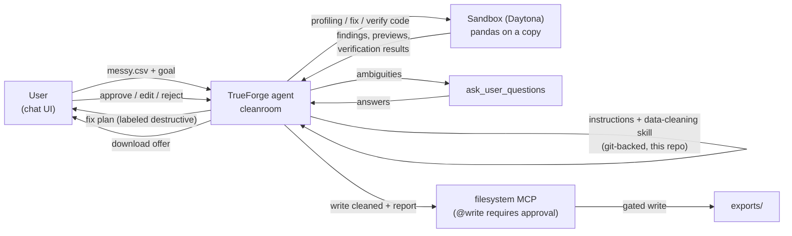

# Cleanroom — Architecture

## Components

| Component | Where | Role |
|---|---|---|
| Agent manifest | `agent/cleanroom.agent.json` | Model, MCP servers, skill refs, runtime config — applied via `scripts/seed-agent.mjs` (PUT/POST `/api/v1/agents`) |
| System prompt | `agent/instructions.md` | The 8-phase workflow: INTAKE → PROFILE → CLARIFY → PLAN → GATE → APPLY → VERIFY → DELIVER |
| Skill | `skills/data-cleaning/SKILL.md` | Git-backed methodology: profiling checklist, fix catalog, pandas patterns, verification suite, change-report format |
| Sandbox | TrueForge → Daytona | Isolated execution; `file_downloads` enabled for artifact retrieval |
| Filesystem MCP | TrueForge Connectors | Read inputs; **writes/deletes require human approval** (the formal gate) |
| Sample corpus | `data/samples/` | Deterministic messy datasets for demos and judge reproducibility |

## Safety invariants

1. Original file never written — only the sandbox copy is mutated.
2. Destructive fixes and exports are gated twice: plan approval (chat) and MCP
   write approval (harness checkpoint).
3. Success is claimed only after the verification suite passes; failures halt
   and report.
4. The change report must reconcile every row: in = out + dropped (reasoned).
